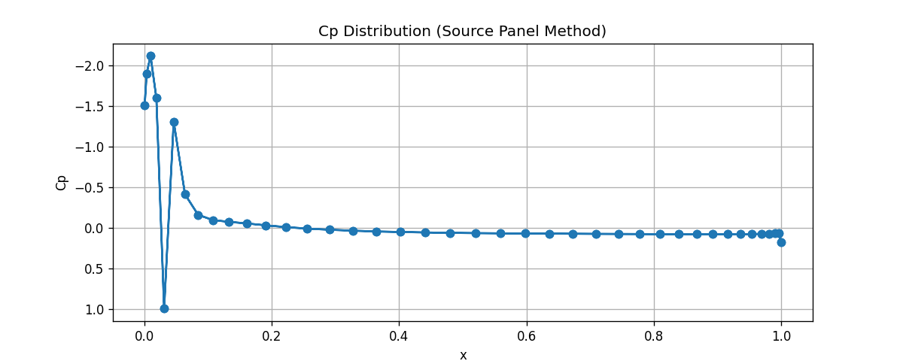

# Source Panel Method for 2D Airfoil Analysis

<p align="center">
  
</p>

<p align="center">
<em>Pressure coefficient (Cp) distribution over a NACA0012 airfoil.</em>
</p>

A Python implementation of the source panel method to compute the surface pressure
distribution (Cp) over a non-lifting 2D body. Here, a NACA0012 airfoil at zero
angle of attack is being used.


## Overview

The Source Panel Method is a numerical technique used to analyse two-dimensional, incompressible, and inviscid flow around bodies such as airfoils. The airfoil surface is divided into a number of straight panels, each represented by a constant-strength source. By enforcing the no-penetration boundary condition at every panel, the unknown source strengths are determined, allowing the surface pressure coefficient (Cp) distribution to be calculated.

This project implements the Source Panel Method in Python to analyse a NACA 0012 airfoil at zero angle of attack. The code reads the airfoil geometry, divides it into panels, constructs the influence coefficient matrix, solves for the source strengths, and computes the pressure coefficient distribution over the airfoil surface.

## Repository Structure

```text
Source-Panel-Method-Airfoil-Analysis/
│
├── airfoils/
│   └── naca0012.dat
├── results/
│   └── cp_distribution.png
├── src
    └── source_panel_method.py
├── README.md
├── requirements.txt
└── LICENSE
```

## Running it

```bash
python source_panel_method.py
```

This produces `cp_distribution.png` and prints a validation check to the console.

## Validation

For a symmetric airfoil at zero angle of attack, the stagnation point sits right at
the leading edge, where Cp should be very close to 1.0. Running this script gives:

```
Max Cp: 0.9987  (close to 1.0 at the stagnation point)
```

This confirms the panel method is correctly enforcing the no-penetration boundary
condition at the surface.

## Methodology

1. Discretize the airfoil surface into N flat panels
2. Place a constant-strength source on each panel
3. Build an N x N influence coefficient matrix from panel geometry
4. Solve for source strengths that satisfy zero normal flow at each control point
5. Recover tangential velocity and surface Cp from the source strengths

## Limitations

- The Source Panel Method models only source singularities and therefore cannot generate circulation or predict lift.
- It is best suited for analysing non-lifting, symmetric bodies at zero or very small angles of attack. It cannot accurately model lifting flows, cambered airfoils, or cases where the Kutta condition is required.
- The method assumes inviscid, incompressible, and irrotational flow, so viscous effects such as boundary layer development, flow separation, and drag are not captured.

## Skills Demonstrated

- Python
- NumPy
- Panel Methods
- Data Visualization (Matplotlib)

## References
- J.D. Anderson, *Fundamentals of Aerodynamics*.
